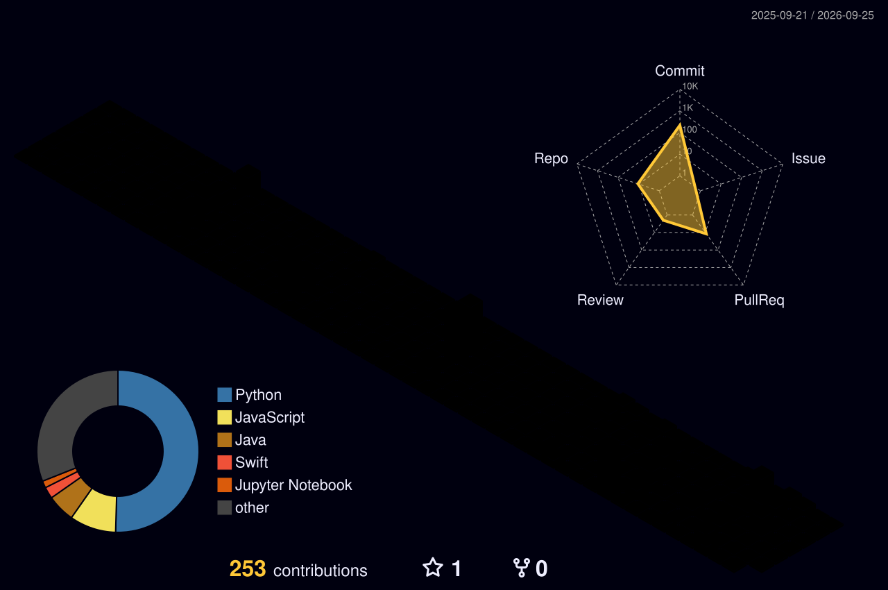

### Hi there! 👋
I'm a Computer Science grad from University of Alberta, who loves working with new and interesting technologies to build fun and meaningful software. Check out my various projects ranging from apps to websites.

 

 

<table>
 <tr>
  <td width="50%">
   
  </td>

  <td width="50%">
   
  </td>
 </tr>
</table>
<!-- great_gatsby flag_india dark darcula codeSTACKr) buefy kacho_ga moltack-->

<!--  -->

<!--
**Oriyans-sunset/Oriyans-sunset** is a ✨ _special_ ✨ repository because its `README.md` (this file) appears on your GitHub profile.

Dark leetcoe stat card themes:

Lighter:

Here are some ideas to get you started:

Better github snake themes:
 
 
 
 
 
 
 

Plain ones:

- 🔭 I’m currently working on ...
- 🌱 I’m currently learning ...
- 👯 I’m looking to collaborate on ...
- 🤔 I’m looking for help with ...
- 💬 Ask me about ...
- 📫 How to reach me: ...
- 😄 Pronouns: ...
- ⚡ Fun fact: ...
-->
